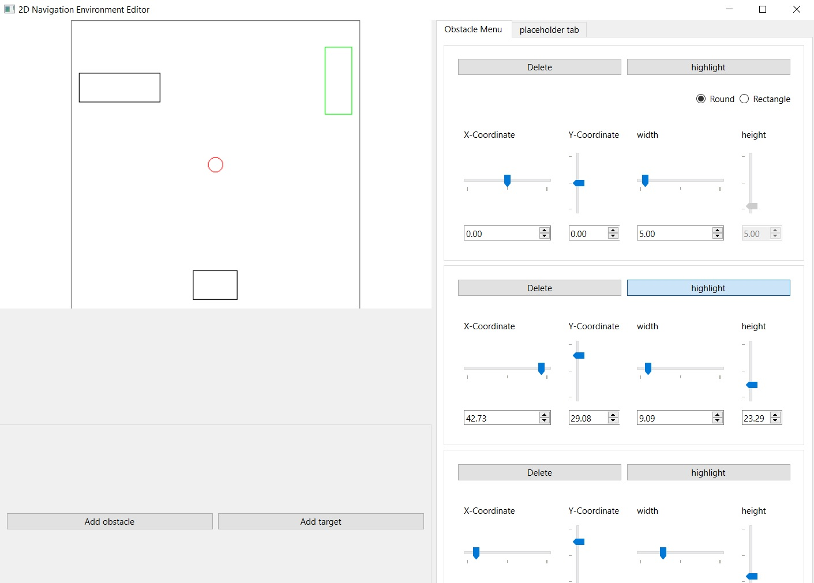

# 2D Navigation Environment Editor

A desktop application built with Python and PyQt6 for visually creating, editing, saving, and loading configurable 2D navigation environments.

The application was developed as part of a two-person university project at the Institute for Neural Computation, Ruhr University Bochum.

## Application Preview



## Overview

The editor provides a graphical interface for configuring virtual navigation environments without manually editing configuration files.

Users can define the environment dimensions, create obstacles, configure a goal area, and save or reload the resulting setup using JSON files.

The project supports open-field and T-maze-style navigation scenarios for research, simulation, and experimentation.

## Academic Context

This application was developed as part of a two-person university project at the Institute for Neural Computation, Ruhr University Bochum.

The project focused on building a graphical editor for configurable 2D navigation environments using Python and PyQt6.

## Features

- Interactive 2D environment canvas
- Mouse-based obstacle creation
- Adjustable obstacle position and dimensions
- Circular and rectangular goal areas
- Configurable environment dimensions
- T-maze geometry controls
- Obstacle highlighting and deletion
- JSON-based configuration loading and saving
- Coordinate transformation between the simulation model and GUI canvas

## Technologies

- Python
- PyQt6
- JSON
- Qt signals and slots
- QPainter
- Git and GitHub

## Project Structure

```text
2d-navigation-environment-editor/
├── config/
│   ├── env_params.json
│   └── sim_params.json
├── src/
│   └── main.py
├── .gitignore
├── README.md
└── requirements.txt
``` 

## Installation 

Download the project:

```bash
git clone https://github.com/TayArmina/2d-navigation-environment-editor.git
cd 2d-navigation-environment-editor
```

Install the required package:

```bash
pip install -r requirements.txt
```

## Running the Application

Run the application from the project folder:

```bash
python src/main.py
```
